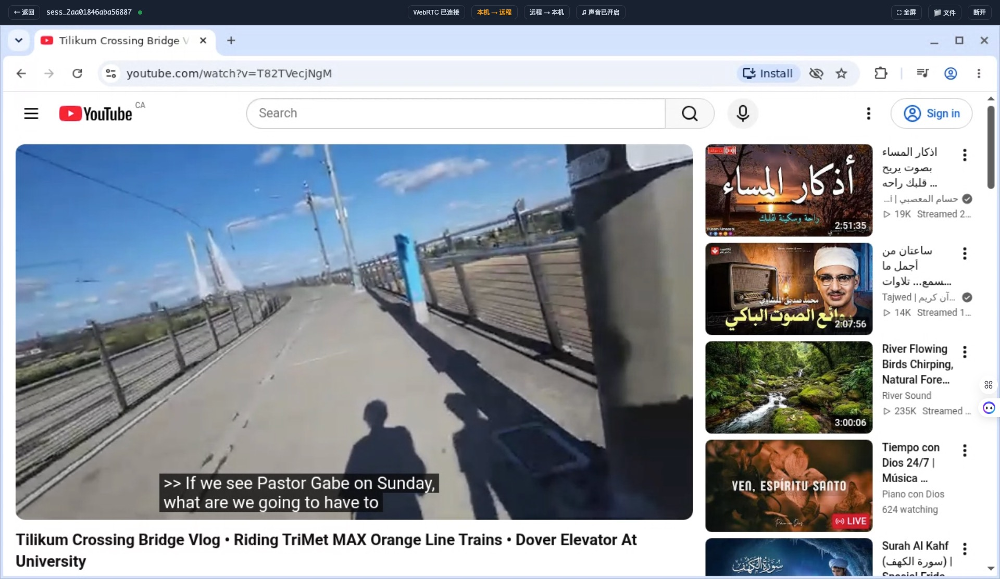
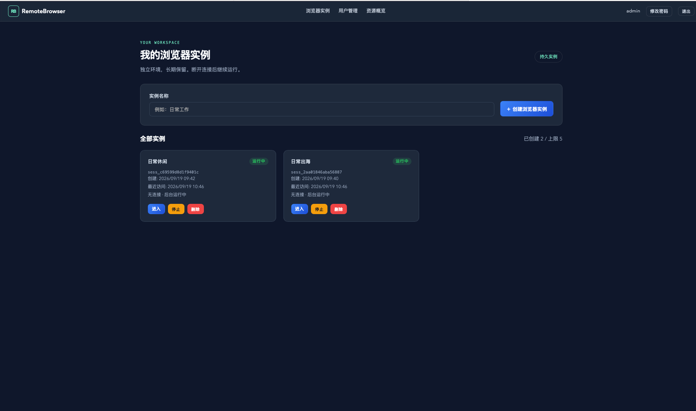
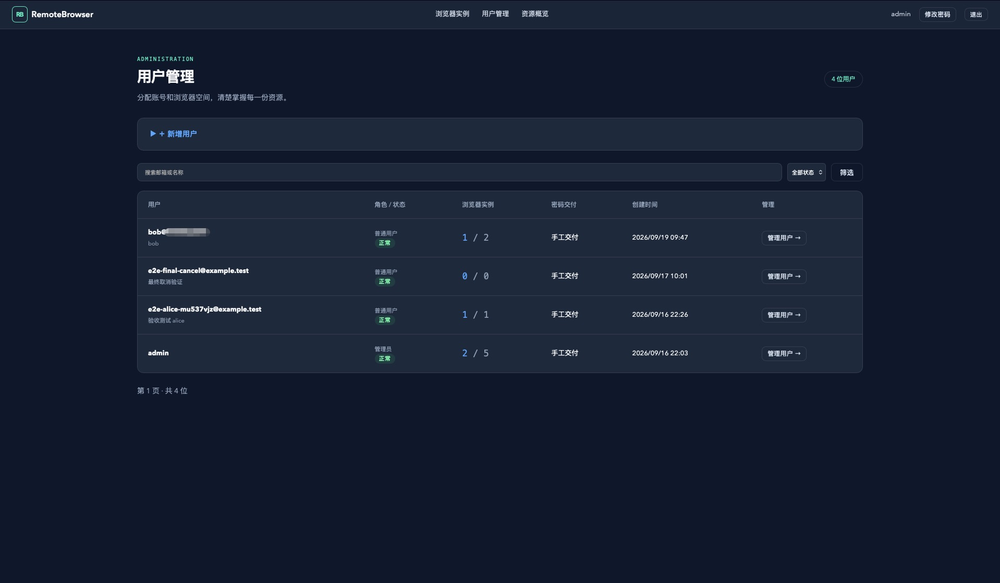
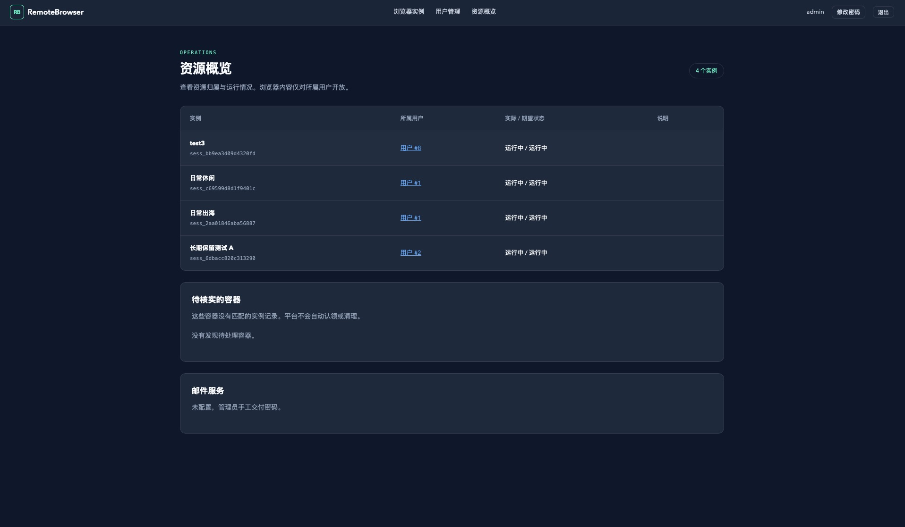

# RemoteBrowser

[简体中文](README.md) | English

RemoteBrowser is a self-hosted, multi-user remote browser platform for individuals and trusted small teams. Administrators create accounts and assign instance quotas. Every instance has an isolated, persistent Chromium profile, cookies, site storage, and downloads directory, accessible through WebRTC or noVNC.

> [!IMPORTANT]
> The Manager mounts the Docker socket and therefore has root-equivalent control of the host. Deploy it on a dedicated VM, do not colocate sensitive workloads, and never expose the Docker API to the network. The current threat model is trusted coworkers, not mutually hostile public tenants.



<details>
<summary>More screenshots</summary>

### Instance management



### User management



### Resource management



</details>

## Features

- Multi-user login, forced initial password change, account disabling, password reset, and session revocation
- Per-user quotas and persistent browser instances
- Low-latency WebRTC video/audio with a noVNC fallback
- Chinese input, clipboard integration, file upload, and download
- Per-instance Docker networks plus CPU, memory, and PID limits
- Administrative user, instance, quota, mail, and resource management
- Host-persisted SQLite data and browser profiles

Instances persist by default. Closing a page, signing out, or leaving an instance idle does not delete it, and stopped instances still count against quota. Data is removed only when the user deletes an instance or an administrator confirms user deletion.

## Use cases

RemoteBrowser runs isolated, persistent browser workspaces on infrastructure you control and makes them available through an ordinary web browser. It is a practical fit for:

- **Browsing through your own server's network:** Route only browser activity through the network egress of a server you lawfully operate, without configuring and maintaining a device-wide VPN on every client. Typical uses include cross-border e-commerce operations, region-specific site administration, and localized content verification that require a stable server egress location.
- **Lightweight multi-account and workspace isolation:** Every instance has its own persistent Chromium profile, cookies, site storage, and downloads directory. When you only need the basic workspace separation offered by commercial multi-profile or anti-detect browsers, RemoteBrowser provides a transparent, self-hosted option.
- **A browser-only gateway for small organizations:** Give team members a central way to reach admin consoles, SaaS products, or other web tools through a designated server network without exposing the server desktop or distributing server credentials. This is a lightweight browser access gateway, not a full bastion host.
- **Browser-based remote work across regions:** Give team members in different locations separate workspaces in one deployment while preserving login state and downloads. This works well for small teams whose daily work is primarily browser-based and does not require a full remote desktop or delivery of native applications.
- **Testing, demonstrations, and temporary collaboration:** Provision revocable, isolated browser environments for regional website checks, persistent-session testing, product demonstrations, or short-term collaborators.

## Scope and non-goals

- RemoteBrowser handles remote Chromium traffic only. It is not a device-wide VPN, general-purpose proxy, or full network tunnel.
- Profile isolation is not fingerprint spoofing. The project does not provide proxy pools, automation orchestration, or anti-detect guarantees, and it cannot guarantee that third-party platforms will not associate different accounts.
- It is not an enterprise bastion host. The current release does not include MFA, approval workflows, session recording, data loss prevention, or comprehensive compliance auditing; its trust model is individuals and trusted small teams.
- It is not a complete remote desktop solution and is intended primarily for browser-based workflows.
- Operators and users are responsible for complying with applicable laws, network policies, and website terms of service. The project is not intended to bypass access controls or platform risk controls.

## Quick start

Docker Engine (or Docker Desktop) and Docker Compose are required. Source development requires Go 1.26.8 or a compatible newer patch release.

```bash
cp .env.example .env
chmod 600 .env
```

Set at least these values in `.env`:

```dotenv
RB_ADMIN_PASSWORD=use-a-strong-password-with-at-least-12-characters
RB_SESSION_HOST_DATA_DIR=/srv/remotebrowser/data
```

Build and start the service:

```bash
mkdir -p /srv/remotebrowser/data
docker build --pull -t remotebrowser/session:latest docker/session
cd deploy
docker compose --env-file ../.env config --quiet
docker compose --env-file ../.env up -d --build
```

Open `http://localhost` and sign in as `admin`. `RB_ADMIN_PASSWORD` is used only for first-time initialization and never overwrites an existing password on restart or upgrade. For a public deployment, set `RB_SITE_ADDRESS` in `.env` to the hostname and set `RB_PUBLIC_URL` to the corresponding user-facing HTTPS URL; Caddy will obtain and renew the certificate automatically. Also set `RB_WEBRTC_ICE_IP` to the host IP reachable by clients.

Do not copy the local configuration directly to an Internet-facing server. Follow the [public deployment guide](docs/public-deployment.en.md) for DNS, Caddy's free automatic HTTPS, cloud and Docker firewall rules, and acceptance checks.

## Key configuration

| Variable | Purpose |
| --- | --- |
| `RB_SITE_ADDRESS` | Caddy site address; use `:80` locally or a hostname such as `browser.example.com` in production. |
| `RB_PUBLIC_URL` | Full user-facing URL, such as `https://browser.example.com`. |
| `RB_WEBRTC_ICE_IP` | Publicly reachable server IP advertised for WebRTC UDP. |
| `RB_SESSION_HOST_DATA_DIR` | Absolute data path on the Docker host; it must remain unchanged across upgrades. |
| `RB_ADMIN_PASSWORD` | Initial administrator password, at least 12 characters. |
| `RB_COOKIE_SECRET` | Optional, at least 32 bytes; when empty, a generated secret is persisted in the data directory. |
| `RB_DEFAULT_INSTANCE_QUOTA` | Default quota for new users; defaults to 5. |
| `RB_MAX_UPLOAD_SIZE` | Per-upload limit; defaults to 100 MiB. |
| `RB_SESSION_CPUS` | CPU limit per instance; defaults to 2. |
| `RB_SESSION_MEMORY_MB` | Memory limit per instance; defaults to 3072 MiB. |
| `RB_SESSION_SHM_MB` | Shared-memory size per instance; defaults to 1024 MiB. |

See [.env.example](.env.example) for all settings and comments. SMTP is optional; leave every `RB_SMTP_*` variable empty when it is disabled.

## Data, backup, and upgrades

The data directory contains the account database, cookie signing secret, browser profiles, and downloads. Use a dedicated disk or at least configure disk-usage alerts; the current release does not implement per-user disk quotas.

Stop the Manager or use SQLite's online backup API before backing up the database. Do not copy only a live database file. Keep the same `RB_SESSION_HOST_DATA_DIR` across upgrades. Updating the Session image does not replace existing containers; schedule maintenance and recreate instance containers while retaining their persistent directories. See [migrations/README.md](migrations/README.md).

## Security notes

The project implements signed login state, CSRF and WebSocket Origin checks, cross-user authorization, account-session revocation, upload limits, Chromium sandboxing, non-root session containers, dropped capabilities, PID / CPU / memory limits, and isolated instance networks. Important boundaries remain:

- The Docker socket is the highest-risk trust boundary; use a dedicated host.
- Login does not currently support MFA. For small-team public deployments, restrict access again at the cloud firewall, VPN, or identity-aware proxy.
- WebRTC publishes dynamic UDP ports on the host; allow only the port range actually in use.
- Instances have Internet access and should not be treated as a hostile-tenant sandbox.
- Host administrators can read persisted data; encrypt and restrict disks, backups, and snapshots.

See [SECURITY.md](SECURITY.md) for reporting, support, and threat-model details. Before the repository is made public for the first time, complete the [pre-publication checklist](docs/pre-publication-checklist.md) (Chinese).

## Development

Build the Session image, set an initial local administrator password, and start the Manager:

```bash
export RB_ADMIN_PASSWORD='replace-with-a-local-development-password'
./scripts/dev.sh
```

The development service listens on `http://localhost:8080` and writes data to `./data`.

Before submitting a change, run:

```bash
go test ./...
go vet ./...
go build ./cmd/manager
(cd docker/session/input-service && go test ./... && go vet ./...)
(cd docker/session/webrtc-service && go test ./... && go vet ./...)
```

Builds and health checks do not replace real user-path testing. Validate video, audio, WebRTC/noVNC switching, Chinese input, clipboard, file transfer, and cross-user authorization in a real browser.

The entry point is under `cmd/manager`, application packages under `internal/`, templates and assets under `web/`, the session image under `docker/session/`, and deployment files under `deploy/`. See [CONTRIBUTING.md](CONTRIBUTING.md) for contribution guidance.

## License

RemoteBrowser is licensed under the [MIT License](LICENSE). Licenses for vendored frontend dependencies are listed in [THIRD_PARTY_NOTICES.md](THIRD_PARTY_NOTICES.md).
